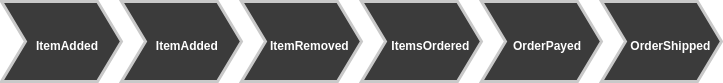
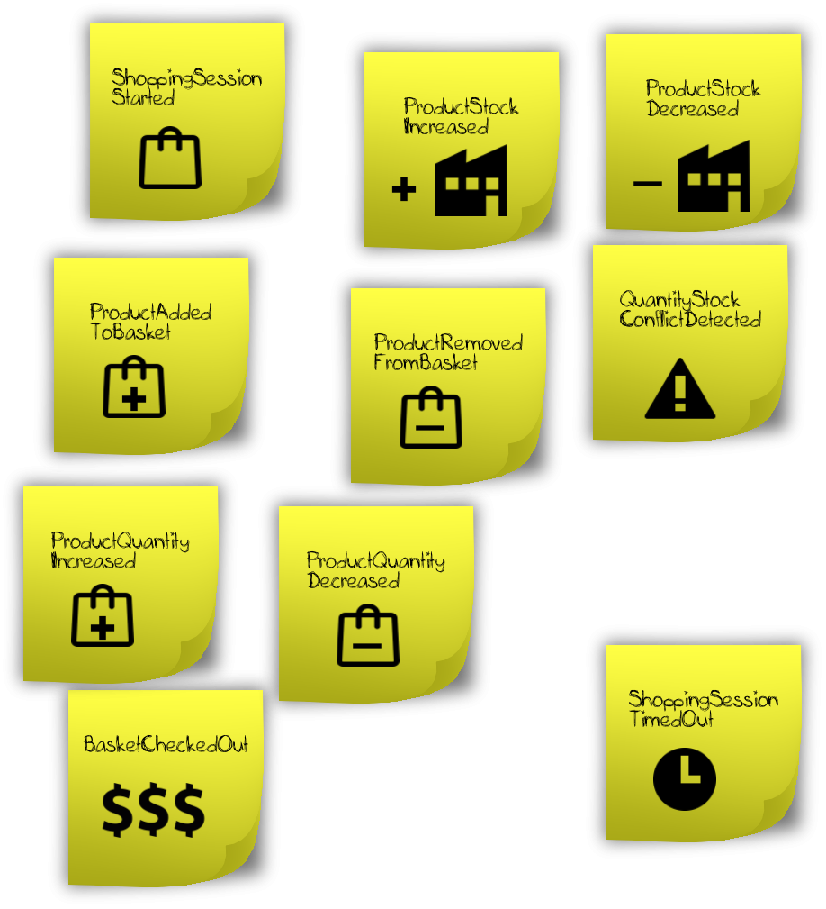

# Event Sourcing Basics

Event Sourcing focuses on business processes. The reason is simple. Every write operation in a domain model causes
a state change. When using Event Sourcing those state changes are described by domain events. For example if an order gets payed
this is a state change (company gets $$$) and we can describe it with an event using past tense: **OrderPayed**.
We simply do that for all state changes. What we get is a series of domain events¹.



**Events happen one after another. They tell us a story about a business process handled by the application.**

## Thinking in Events

The previous page "Why Event Sourcing" made a point about database driven designs and how Event Sourcing differs from that.
In Event Sourcing we start with thinking in events. 

Every coding tutorial needs a playground. Ours is an eCommerce domain and our first job is to implement a shopping basket.
Business tells us that customers can browse an online shop frontend and add available products to their basket.
The customers don't need to be signed in so their basket is assigned to a shopping session until checkout.
So far, so good. But the business wants us to implement realtime stock updates.
While browsing the online shop customers should see constantly updated information about how many other customers
have the same products in their basket: "*5 other customers want to buy the same product at the minute*".
If one customer performs a checkout stock of the product should be reduced immediately along with a notification:
"*Product {name} was bought by customer from {localization} {time span} ago*".

Here is a simplified result of the event storming² session:



As you can see we have a variety of different events. We not only have events that are caused by the customer while
interacting with their shopping basket but also events caused by changes in foreign shopping sessions. We even have
two "error events" defined: *QuantityStockConflictDetected, ShoppingSessionTimedOut*.

## Defining Events

In the tutorial introduction we already took a look at prooph messages and created our first command. Events are created in a 
similar fashion. In fact they are just another type of message. Hence, each prooph event is an implementation of `Prooph\Common\Messaging\Message`.

You still have the `prooph_tutorial` project at hand with `prooph/common` installed via composer? If not, please go back to
the [introduction](introduction.html) and follow the steps there before continuing with the Event Sourcing tutorial.

We need a project structure for our shopping basket implementation. 

```
|_ Basket
| |_ scripts           
| |_ src
| | |_ Infrastructure
| | | |_ Prooph
| | |_ Model
| | | |_ Basket
| | | |_ Command
| | | |_ Event
| | | |_ ERP
| | | |_ Exception
| | |_ Projection
| |   |_ Query
| |_ tests
|    |_Model
|_ scripts
```

Run the following command in the `prooph_tutorial` directory.

```bash
$ mkdir -p ./Basket/src/Infrastruture/Prooph \
    ./Basket/src/Model/Command/ \
   ./Basket/src/Model/Event/ \
   ./Basket/src/Model/Basket/ \
   ./Basket/src/Model/ERP/ \
   ./Basket/src/Model/Exception/ \
   ./Basket/src/Projection/Query \
   ./Basket/tests/Model \
   ./scripts
```

Replace `composer.json` with this version and run `composer update`:

```json
{
    "autoload": {
        "psr-4": {"App\\Basket\\": "Basket/src/"}
    },
    "autoload-dev": {
        "psr-4": {"App\\BasketTest\\": "Basket/tests/"}
    },
    "require": {
        "prooph/common": "^4.1",
        "prooph/event-sourcing": "^5.2"
    },
    "require-dev": {
        "phpunit/phpunit": "^6.0"
    }
}
``` 
We just configured composer's autoloader to use the namespace `App\Basket`  for our `Basket` context and the appropriate
test namespace `Àpp\BasketTest`.
We've also added the package `prooph/event-sourcing` to the list of dependencies and told composer to install `phpunit/phpunit`
when we're in dev mode.

You can guess that `prooph/event-sourcing` provides the basic implementation needed to develop an event sourced domain model.

Now it's time to define our first domain event. We place all events in `./Basket/src/Model/Event/`

*File: ./Basket/src/Model/Event/ShoppingSessionStarted.php*
```php
<?php

declare(strict_types=1);

namespace App\Basket\Model\Event;

use App\Basket\Model\Basket\BasketId;
use App\Basket\Model\Basket\ShoppingSession;
use Prooph\EventSourcing\AggregateChanged;

final class ShoppingSessionStarted extends AggregateChanged
{
    public function basketId(): BasketId
    {
        //Note: Internally, we work with scalar types, but the getter returns the value object
        return BasketId::fromString($this->aggregateId());
    }

    public function shoppingSession(): ShoppingSession
    {
        //Same here, return domain specific value object
        return ShoppingSession::fromString($this->payload['shopping_session']);
    }
}

```
What we do here is extending the base event class `AggregateChanged` from the `prooph/event-sourcing` package.
More about aggregates in a minute. First let's have a look at what the base event class has to offer:

```php
<?php

declare(strict_types=1);

namespace Prooph\EventSourcing;

use Assert\Assertion;
use Prooph\Common\Messaging\DomainEvent;

class AggregateChanged extends DomainEvent
{
    /**
     * @var array
     */
    protected $payload = [];

    public static function occur(string $aggregateId, array $payload = []): self
    {
        return new static($aggregateId, $payload);
    }
    //...
}
```
`AggregateChanged` extends `Prooph\Common\Messaging\DomainEvent`. That's the link back to `prooph/common` and turns
all events into prooph messages. Keep that in mind as this is an important information needed later when we want to
send events around.

We also see a static factory method called `occur` that takes an `$aggregateId` and `$payload` as arguments.
The `$aggregateId` is a reference to the corresponding aggregate. **Every domain event belongs to exactly one aggregate**.

## Event Sourced Aggregates

Event Sourced Aggregates are Domain-Driven Aggregates - units of consistency. 
They protect invariants. This basically means that an aggregate makes sure that it can transition to a new state.
Different business rules can permit or prevent those state transitions. The aggregate has to enforce the business rules. 

In our case we need to consider following business rules:

- *A shopping session is started with an empty basket.*
- *Each shopping session gets its own basket assigned.*
- *A product can only be added to a basket if at least one product is available in stock.*
- *Product quantity in a basket must not be higher than available stock.*
- *If stock is reduced by a checkout, product quantity in currently active baskets need to be checked and conflicts resolved.*
- *If product quantity in a basket is reduced to zero or less the product is removed from the basket.*
- *A checkout can only be made if no unresolved quantity-stock-conflicts exist for the basket.*

Looking at the rules we can identify a repeating pattern. Every rule includes a state check against a basket and/or describes
a state transition of a basket. With our current understanding of the domain we're good to go with a `Basket` aggregate that
enforces the business rules described above. 

Even if we name our aggregate only `Basket` you can think of it like it would be named `BasketProcess`. 
We don't do it that way because it does not reflect the Ubiquitous Language³ which we draw off from the language used by the business.
However, when implementing Event Sourcing you can always keep that `Process` suffix in mind. 

Recap: Every state transition is described by an event. Events happen one after another. They tell us a story about
a business **process**. Indeed, an aggregate is a process consisting of multiple steps happening in a sequence.
Whereby, each next step is validated by the aggregate upfront using current state:

*A checkout can only be made if no unresolved quantity-stock-conflicts exist for the basket.*

Effective Aggregate Design¹¹ is possibly the hardest part of a well crafted domain model. And it evolves over time so
be prepared to constantly refactor previous design decisions. Thinking of aggregates as processes and model them in an event
sourced fashion can help a lot, but it remains a task that needs practice. So don't worry if your first attempts end up
being unpractical. You will get better. **Thinking in events and processes is the key.**

Let's add the `Basket` aggregate now.

*File: ./Basket/src/Model/Basket.php*
```php
<?php

declare(strict_types=1);

namespace App\Basket\Model;

use Prooph\EventSourcing\AggregateChanged;
use Prooph\EventSourcing\AggregateRoot;

final class Basket extends AggregateRoot
{
    protected function aggregateId(): string
    {
        // TODO: Implement aggregateId() method.
    }

    /**
     * Apply given event
     */
    protected function apply(AggregateChanged $event): void
    {
        // TODO: Implement apply() method.
    }
}
```   
Our `Basket` class extends `Prooph\EventSourcing\AggregateRoot`. This is the base class for all event sourced aggregates.
Later we'll also look at an alternative approach using traits instead of extending a prooph class but the
version shown here is easier to understand and helps us with the first steps. `AggregateRoot` is an abstract class and asks us to implement
two methods `aggregateId()` which should provide the string representation of the globally unique identifier of the aggregate
and an `apply()` method.

The `apply()` method is best explained with an example so let us dive into the implementation. Each aggregate has a
lifecycle. To start such a lifecycle we need to create the aggregate. But prooph's `AggregateRoot` does not allow to use 
the class constructor as public method. Instead we're asked to use a so called **named constructor** aka static factory method.

*File: ./Basket/src/Model/Basket.php*
```php
<?php

declare(strict_types=1);

namespace App\Basket\Model;

use App\Basket\Model\Event\ShoppingSessionStarted;
use App\Basket\Model\Basket\BasketId;
use App\Basket\Model\Basket\ShoppingSession;
use Prooph\EventSourcing\AggregateChanged;
use Prooph\EventSourcing\AggregateRoot;

final class Basket extends AggregateRoot
{
    public static function startShoppingSession(
        ShoppingSession $shoppingSession, 
        BasketId $basketId)
    {
        //Start new aggregate lifecycle by creating an "empty" instance
        $self = new self();
        
        //Record the very first domain event of the new aggregate
        //Note: we don't pass the value objects directly to the event but use their
        //primitive counterparts. This makes it much easier to work with the events later
        //and we don't need complex serializers when storing events.
        $self->recordThat(ShoppingSessionStarted::occur($basketId->toString(), [
            'shopping_session' => $shoppingSession->toString()
        ]));
        
        //Return the new aggregate
        return $self;
    }

    protected function aggregateId(): string
    {
        // TODO: Implement aggregateId() method.
    }

    /**
     * Apply given event
     */
    protected function apply(AggregateChanged $event): void
    {
        // TODO: Implement apply() method.
    }
}

```
A meaningful named constructor using the Ubiquitous Language is a great way to let the code document itself. 
The `Basket` aggregate requires a `ShoppingSession` and a `BasketId` to start the shopping session. 
Both are value objects that we're going to add next.

*Note: BasketId becomes the identifier of the aggregate but it is created outside of the aggregate. That's a common pattern in
a CQRS system. For example the frontend can create a BasketId using a JavaScript UUID library and send the BasketId to
the backend. Remember from the introduction chapter: Handling a command has no response other than success or failure. In case
of success the frontend can use the BasketId to fetch state of the Basket from a read model. Later in the tutorial we'll
see that in action. For now just keep in mind that aggregate ids are created by the client or application layer
if a CQRS architecture is used.*

*File: ./Basket/src/Model/Basket/ShoppingSession.php*
```php
<?php

declare(strict_types=1);

namespace App\Basket\Model\Basket;

final class ShoppingSession
{
    private $shoppingSession;

    public static function fromString(string $shoppingSession): self
    {
        return new self($shoppingSession);
    }

    private function __construct(string $shoppingSession)
    {
        if($shoppingSession === '') {
            throw new \InvalidArgumentException("Shopping session must not be an empty string");
        }

        $this->shoppingSession = $shoppingSession;
    }

    public function toString(): string
    {
        return $this->shoppingSession;
    }

    public function equals($other): bool
    {
        if(!$other instanceof self) {
            return false;
        }

        return $this->shoppingSession === $other->shoppingSession;
    }

    public function __toString(): string
    {
        return $this->shoppingSession;
    }
}

```

*File: ./Basket/src/Model/Basket/BasketId.php*
```php
<?php
declare(strict_types=1);

namespace App\Basket\Model\Basket;

use Ramsey\Uuid\Uuid;

final class BasketId
{
    private $basketId;

    public static function fromString(string $basketId): self
    {
        return new self($basketId);
    }

    private function __construct(string $basketId)
    {
        if(!Uuid::isValid($basketId)) {
            throw new \InvalidArgumentException("Given basket id is not a valid UUID. Got " . $basketId);
        }

        $this->basketId = $basketId;
    }

    public function toString(): string
    {
        return $this->basketId;
    }

    public function equals($other): bool
    {
        if(!$other instanceof self) {
            return false;
        }

        return $this->basketId === $other->basketId;
    }

    public function __toString(): string
    {
        return $this->basketId;
    }
}

```
Recap: We used a named constructor to create the `Basket` aggregate. The named constructor defines the requirements needed
to start a shopping session, namely the `ShoppingSession` and `BasketId`. Instead of setting those value objects as properties
in the `Basket` aggregate we **record** the first domain event `ShoppingSessionStarted` of the aggregate.

Now the `apply()` method comes into play. Our `Basket` aggregate will have many more methods later to deal with all things
happening during a shopping session. And in those methods we will often need the current **state** of the aggregate to
**protect invariants**. To get access to the state we need to `apply()` recorded domain events in the exact same order as
they were recorded. Prooph's `ÀggregateRoot` takes care of the latter but it does not know **how** a domain event should
be applied. Hence, we need to take over that task.

*File: ./Basket/src/Model/Basket.php*
```php
<?php

declare(strict_types=1);

namespace App\Basket\Model;

use App\Basket\Model\Event\ShoppingSessionStarted;
use App\Basket\Model\Basket\BasketId;
use App\Basket\Model\Basket\ShoppingSession;
use Prooph\EventSourcing\AggregateChanged;
use Prooph\EventSourcing\AggregateRoot;

final class Basket extends AggregateRoot
{
    /**
     * @var BasketId
     */
    private $basketId;

    /**
     * @var ShoppingSession
     */
    private $shoppingSession;

    public static function startShoppingSession(ShoppingSession $shoppingSession, BasketId $basketId)
    {
        $self = new self();
        $self->recordThat(ShoppingSessionStarted::occur($basketId->toString(), [
            'shopping_session' => $shoppingSession->toString()
        ]));
        return $self;
    }

    protected function aggregateId(): string
    {
        // TODO: Implement aggregateId() method.
    }

    /**
     * Apply given event
     */
    protected function apply(AggregateChanged $event): void
    {
        //A simple switch by event name is the fastest way,
        //but you're free to split things up here and have for example methods like
        //private function whenShoppingSessionStarted()
        //To delegate work to them and keep the apply method lean 
        switch ($event->messageName()) {
            case ShoppingSessionStarted::class:
                /** @var $event ShoppingSessionStarted */
                
                $this->basketId = $event->basketId();
                $this->shoppingSession = $event->shoppingSession();
                break;
        }
    }
}

```

Now that we have access to the current state we can finally implement the `aggregateId()` method to fulfill the contract
defined by prooph's `AggregateRoot` class.

*File: ./Basket/src/Model/Basket.php*
```php
<?php

declare(strict_types=1);

namespace App\Basket\Model;

//...

final class Basket extends AggregateRoot
{
    /**
     * @var BasketId
     */
    private $basketId;

    /**
     * @var ShoppingSession
     */
    private $shoppingSession;

    public static function startShoppingSession(ShoppingSession $shoppingSession, BasketId $basketId)
    {
        //...
    }

    protected function aggregateId(): string
    {
        //Return string representation of the globally unique identifier of the aggregate
        return $this->basketId->toString();
    }

    /**
     * Apply given event
     */
    protected function apply(AggregateChanged $event): void
    {
        //...
    }
}

```
Ok, that are the basics of Event Sourcing. Many new things to learn, right? But don't worry. You'll get used to it while
we look at some more aspects of Event Sourcing. In the next part we will look at testing event sourced aggregates
which is super easy when you have a clean and decoupled domain model.

*Advise: Revisit the basics part whenever you feel lost. Event Sourcing is really simple once you understand it.
In the section below you can find links to related blog posts. But before you follow them take a break and let 
the basics sink in. You can read the posts later when you feel more comfortable with Event Sourcing. Don't overload your
head with too much information at a time.* 

## Related reads

- [Domain Events - Mathias Verraes](http://verraes.net/2014/11/domain-events/)¹
- [What is EventStorming - Alberto Brandolini](http://ziobrando.blogspot.de/2013/11/introducing-event-storming.html)²
- [Ubiquitous Language - Martin Fowler](https://martinfowler.com/bliki/UbiquitousLanguage.html)³
- [Effective Aggregate Design - Vaughn Vernon](https://vaughnvernon.co/?p=838)¹¹