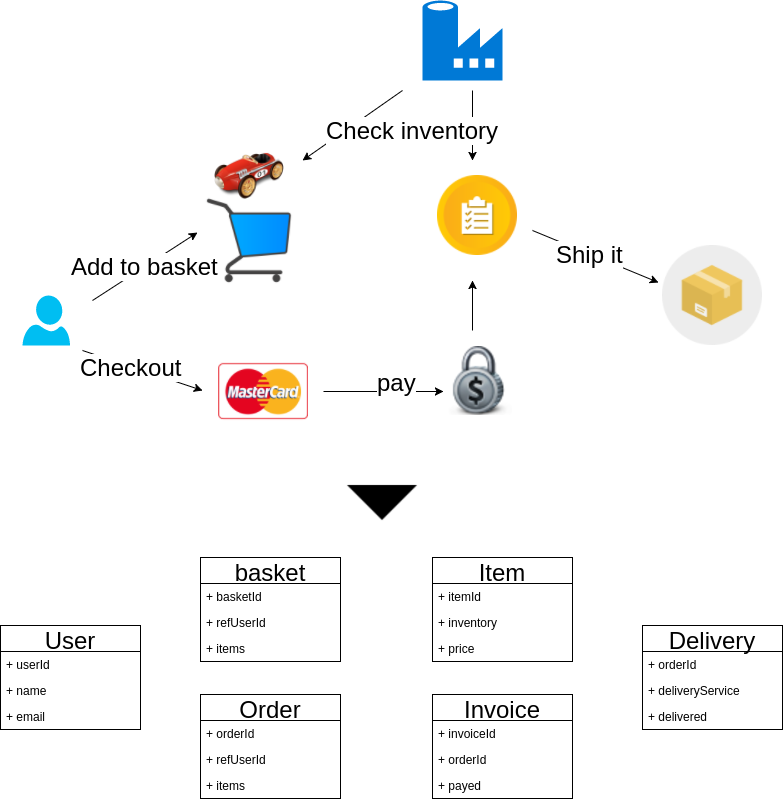

# Why Event Sourcing?

Event Sourcing is a fascinating topic, but it turns out that the learning curve is steep. The reason for it is not
that Event Sourcing is a complex pattern but instead it **conflicts** with our current understanding of object oriented 
programming **centered around data**. 
More or less this understanding is driven by the way how we work with databases, mostly relational databases but 
it is not limited to them.

Our primary goal is to put consistent data in a database and keep it consistent there. One of the common ways is to normalize
data. Here the problem starts. 

**Mapping the real world to a normalized view is a complex task** and we tend to do it before 
we do anything else. Business describes a new feature and we immediately think of a possible 
data structure that fits into our favorite database design. We can share this thinking with our 
teammates because every programmer did the same in their head already so we can simply match results and are good to go. Are we?

Well, not really. Often the first idea of a data structure does not work as expected so we have to reshape it and try again.
Oh and not to forget this shitty real world. No one wants to view normalized data. So we have to write queries and make heavy use of data
joins. Then we recognize that fetching the data with joins is inefficient and we use caches and other techniques to work around
the limitation instead of solving the problem in the first place!

But that's not all. The worst thing with this approach is that we design our application logic around data 
and not around behaviour.

**We skip the behaviour part of a feature description, turn the feature into our own view of normalized state
 and then reverse engineer behaviour.**  

It's not hard to imagine that this approach leads to an application design driven by the database. So in fact it is a
technical design which is far away from the original idea of the business.
If you think this is the best way to tackle complexity of software then you can likely stop reading here because you won't have any
fun with Event Sourcing.

But if you cannot get rid of the feeling that there is something inherently wrong with database driven designs then
you should read on, follow the tutorial and slowly but surely become a software developer focused on real business behaviour.

Event Sourcing has many advantages in modern systems. It helps with coordinating work across different services.
It can be used to solve performance and concurrency problems and many more. 

**But the most important advantage of Event Sourcing is the focus on behaviour.** 

